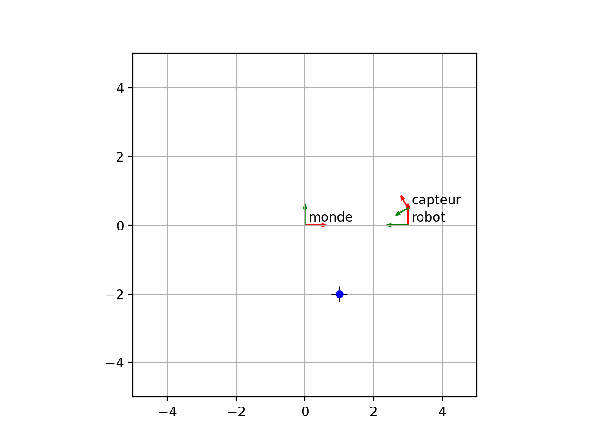

# 2D Pose & Transformation Visualizer



A robot travels along a circular path with a sensor rigidly mounted on it.
A fixed landmark (black cross) is "measured" by the sensor at every frame,
then re-projected back into the world frame (blue dot). If the transform
algebra is correct, the blue dot stays pinned to the cross while everything
else moves — a live integration test of the whole transform chain.

## Concepts

- 2D poses and homogeneous transformation matrices (3×3)
- Frame composition and inversion (`T_world←sensor = T_world←robot ∘ T_robot←sensor`)
- Expressing points across a frame tree (world → robot → sensor and back)
- The "fixed-point" round-trip test as a system-level sanity check
- Angle normalization, floating-point tolerant testing

## Code structure

- `transforms2d.py` — a small, dependency-light `Pose2D` class
  (`compose`, `inverse`, `transform_point`), written from scratch with NumPy.
  Runs its own test suite when executed directly.
- `demo.py` — Matplotlib animation: trajectory, frame tree, and the
  fixed-point test.

## Run it

```bash
pip3 install numpy matplotlib pytest
python3 demo.py           # animation
pytest  # tests (silent = all green)
```
